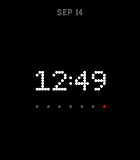

# Nothing watchface for PebbleOS

## Development

1. Install `uv`: `sudo pacman -S uv`
2. Install `pebble-tool`: `uv tool install pebble-tool`
3. Setup generation of compile_commands.json as described [here](https://github.com/coredevices/pebble-tool/issues/6)
4. Run emulator: `pebble build && pebble install --logs --emulator emery`.
   The keybinds are as follows:
   | Button | Key            |
   | ------ | -------------- |
   | Back   | Q, left arrow  |
   | Up     | W, up arrow    |
   | Select | S, right arrow |
   | Down   | X, down arrow  |
   [source](https://developer.rebble.io/guides/tools-and-resources/pebble-tool/)

